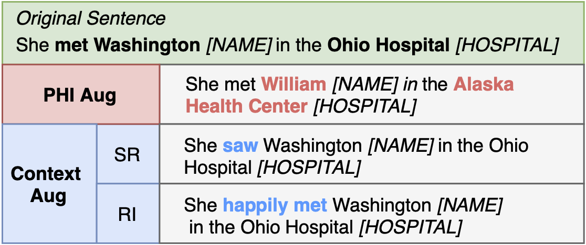

# PHICON

## 1.Introduction
This repository contains source code for paper "PHICON: Improving Generalization of Clinical Text De-identification Models via Data Augmentation"(accepted by EMNLP'20 The 3rd Clinical Natural Language Processing Workshop). PHICON is a simple yet effective data augmentation method to alleviate the generalization issue in de-identification. PHICON consists of PHI augmentation and Context augmentation (as shown in Figure 1), which creates augmented training corpora by replacing PHI entities with named-entities sampled from external sources, and by changing background context with synonym replacement or random word insertion, respectively.


Figure. 1: Toy examples of our PHICON data augmentation. SR: synonym replacement. RI: random insertion.

## 2. Usage
Will release the code soon.

## 3. Citation
Please kindly cite the paper if you use the code or any resources in this repo:
```bib
@inproceedings{yue2020phicon,
 title={PHICON: Improving Generalization of Clinical Text De-identification Models via Data Augmentation},
 author={Xiang Yue and Shuang Zhou},
 booktitle={Proceedings of the 3rd Clinical Natural Language Processing Workshop},
 year={2020}
}
```


